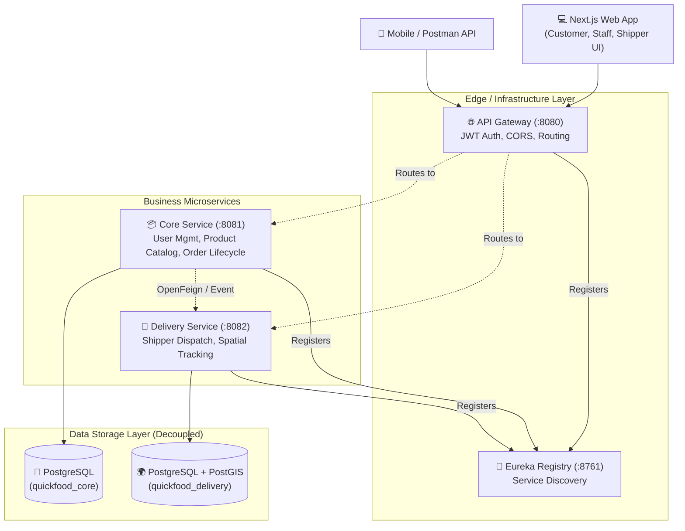
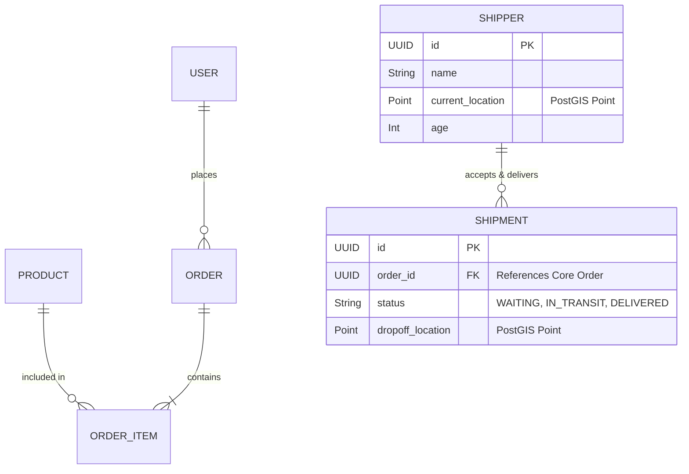

# 🍔 QuickFood — Enterprise-Grade Food Delivery Platform  

<div align="center">


**A modern, highly scalable, and fully containerized full-stack food delivery ecosystem.**
*Designed and engineered end-to-end (System Architecture, Backend Microservices, and Frontend UI) to mimic the core functionalities of industry leaders like UberEats and DoorDash.*

</div>

---

## 🎯 Executive Summary

**QuickFood** is a comprehensive food ordering and delivery platform built with a strict **Microservices Architecture**. It guarantees fault tolerance, horizontal scalability, and seamless user experiences across multiple roles. The project highlights advanced system design patterns, real-time spatial tracking capabilities, and rigorous concurrency management.

**End-to-End Ownership:** This project was developed entirely from scratch by a single developer, covering database design, backend microservices implementation, frontend UI/UX integration, and Dockerized DevOps pipelines.

---

## ✨ Core Technical Achievements

* **🏗️ Robust Microservices Ecosystem:** Engineered highly cohesive, loosely coupled services using **Spring Boot 3**. Orchestrated via **Netflix Eureka** for dynamic service discovery and **Spring Cloud Gateway** for centralized routing and JWT-based security.
* **📍 Real-Time Geospatial Processing:** Integrated **PostgreSQL with PostGIS** extensions to execute complex geographical queries. Enabled real-time driver location tracking, distance calculation, and precise delivery radius validation.
* **⚡ Concurrency & Race Condition Handling:** Successfully implemented robust transactional locking mechanisms. When multiple drivers simultaneously attempt to accept the same `WAITING` order, the system guarantees absolute data integrity—granting the order to exactly one driver while safely rejecting the others.
* **💻 Modern Multi-Role Frontend:** Developed a fully typed, responsive web application using **Next.js (React)**, featuring distinct, role-based dashboards for Customers, Restaurant Staff, and Delivery Drivers (Shippers).
* **🐳 Fully Containerized Infrastructure:** Streamlined the entire deployment lifecycle using **Docker Compose**, allowing the entire distributed system (databases, registry, gateway, and business services) to be spun up locally with a single command.

---

## 🏛️ System Architecture

The architecture is designed to enforce microservice data sovereignty principles, decouple domains, and optimize for both performance and security.



---

## 🗄️ Domain-Driven Data Model (ERD)

The system adheres to the Database-per-Service pattern to ensure high availability and prevent domain leakage.



---

## 🧪 Quality Assurance & Resilience Strategies

High reliability is enforced through rigorous testing methodologies:

* **Boundary Value Analysis:** Strict validation applied to business rules (e.g., Shipper onboarding enforces precise age limits: testing exact `18 years` vs `18 years - 1 day` thresholds).
* **Geospatial Validation:** Boundary testing for coordinate ingestion (`lat: -90 to 90`, `lng: -180 to 180`), completely neutralizing anomalous spatial data errors.
* **Concurrency & Transaction Management:** Engineered pessimistic/optimistic locking strategies during the highly concurrent "Driver Order Acceptance" phase to eliminate race conditions and double-booking.

---

## 🚀 Getting Started

### Prerequisites
* [Docker](https://www.docker.com/) & [Docker Compose](https://docs.docker.com/compose/)
* [Node.js 18+](https://nodejs.org/) (for local frontend execution)

### 1. One-Click Backend Deployment (Docker)
Spin up the entire infrastructure natively—including PostgreSQL/PostGIS, Eureka, API Gateway, Core, and Delivery services.

```bash
git clone [https://github.com/sangvirgo/quickfood.git](https://github.com/sangvirgo/quickfood.git)
cd quickfood
docker compose up --build -d
```
*(Note: Please allow ~30 seconds for the Eureka server to fully register all microservice instances before making API calls.)*

### 2. Start the Frontend Application
```bash
cd quickfood-fe
npm install
npm run dev
```

### 🌍 Application Access Points
| Component | Local URL | Purpose |
|---|---|---|
| **Next.js Web App** | `http://localhost:3000` | Full UI for Customers, Staff, and Drivers |
| **API Gateway** | `http://localhost:8080` | Centralized entry point for all API requests |
| **Eureka Dashboard** | `http://localhost:8761` | Microservice instance monitoring |
| **PostgreSQL DBs** | `localhost:5432` | Dual decoupled schemas via `init-db.sql` |

---

## 📡 API Documentation (Postman)

A pre-configured Postman collection is included for rapid API evaluation.

1.  Locate `QuickFood-API.postman_collection.json` in the `/BACKEND` directory.
2.  Import the collection into your Postman workspace.
3.  Execute the **Register/Login** endpoints to automatically inject the JWT into your environment variables.
4.  Explore the secure microservice endpoints (`Products`, `Orders`, `Shipments`).

---

## 📁 Repository Structure

```text
quickfood/
├── BACKEND/
│   ├── api-gateway/            # Centralized edge routing & JWT verification
│   ├── eureka-server/          # Netflix Eureka Service Registry
│   ├── core-service/           # Product catalog, shopping cart, user management
│   └── delivery-service/       # Routing, PostGIS spatial queries, delivery lifecycle
├── quickfood-fe/               # Next.js 14 Frontend application (App Router)
├── docker-compose.yml          # Container orchestration & dependency management
├── init-db.sql                 # Automated database initialization & PostGIS setup
├── sqa_report.md               # Software Quality Assurance & Edge-case test reports
└── README.md
```

---

## 👨‍💻 Author

**Nguyễn Lưu Tấn Sang** 
