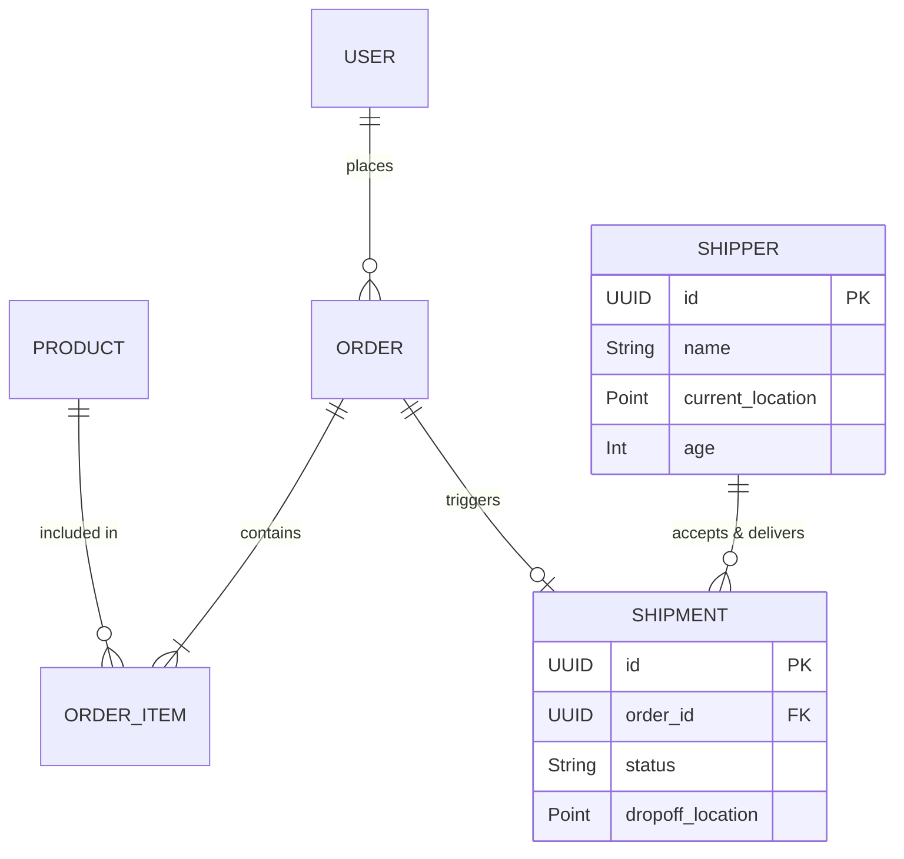

# 🍔 QuickFood — Full-Stack Microservices Delivery Platform

<div align="center">


**A modern, scalable, and fully containerized food delivery platform.** *Built with Spring Boot Microservices, Next.js, and PostGIS for real-time spatial tracking.*

</div>

---

## 🎯 Executive Summary

**QuickFood** is an end-to-end food ordering and delivery system engineered to mimic the core functionalities of industry leaders like DoorDash or UberEats. Designed with a strict **Microservices Architecture**, the backend ensures fault tolerance and horizontal scalability. It integrates with a responsive **Next.js** frontend dashboard tailored for diverse user roles (Customers, Staff, and Shippers). 

---

## ✨ Key Features & Technical Highlights

* **Robust Microservices Ecosystem**: Isolated bounded contexts leveraging **Netflix Eureka** for service discovery and **Spring Cloud Gateway** for centralized routing and JWT-based authentication.
* **Geospatial Processing**: Utilizes **PostgreSQL + PostGIS** to perform complex geographical queries, enabling real-time driver location tracking and delivery radius validation.
* **Modern Frontend**: A fully typed **Next.js (React)** web application featuring tailored dashboards for customers, restaurant staff, and delivery drivers.
* **Concurrency & Reliability**: Engineered to handle race conditions (e.g., concurrent shipment acceptance by multiple drivers) ensuring transactional integrity.
* **Containerized Infrastructure**: Fully automated deployment lifecycle using **Docker Compose** for seamless local setup.

---

## 🏗 System Architecture & Design

The platform relies on a distributed architecture to separate concerns, improve security, and streamline independent deployments.

### High-Level Architecture Flow

```mermaid
graph TD
    %% Frontend Clients
    Client_Web[Next.js Web App / UI] --> Gateway
    Client_Mobile[Mobile App / Postman] --> Gateway
    
    %% API Gateway Layer
    subgraph Spring Cloud Infrastructure
        Gateway[API Gateway<br/>:8080 | Auth & Routing]
        Eureka[Eureka Discovery<br/>:8761 | Service Registry]
    end
    
    Gateway --> Eureka
    Gateway -.-> Core
    Gateway -.-> Delivery

    %% Business Microservices
    subgraph Microservices
        Core[Core Service<br/>:8081<br/>Products, Orders, Users]
        Delivery[Delivery Service<br/>:8082<br/>Tracking, Shippers]
    end

    %% Database Layer
    Core --> DB_Core[(PostgreSQL<br/>quickfood_core)]
    Delivery --> DB_Delivery[(PostgreSQL + PostGIS<br/>quickfood_delivery)]
```

---

## 🗄️ Conceptual Entity Relationship (UML)

The data layer is decoupled into two independent PostgreSQL schemas to uphold microservice data sovereignty principles.



---

## 🧪 Quality Assurance & Testing

Software quality is rigorously enforced through comprehensive test cases and systematic validation methodologies:

* **Boundary Value Analysis**: Strict validation for business rules (e.g., Shipper minimum age limits with exact `18 years`, `18 years - 1 day` thresholds).
* **Geospatial Validation**: Coordinate boundary testing (`lat: -90 to 90`, `lng: -180 to 180`) preventing anomalous data ingestion.
* **Concurrent Handling (Race Conditions)**: Transaction locking to ensure that if multiple shippers attempt to accept the same `WAITING` shipment simultaneously, only one succeeds while others receive graceful failure responses.

---

## 🚀 Getting Started

### Prerequisites
* [Docker](https://www.docker.com/) & [Docker Compose](https://docs.docker.com/compose/)
* [Node.js 18+](https://nodejs.org/) (for frontend execution)

### 1. One-Click Backend Deployment
Spin up the entire infrastructure (Databases, Eureka, Gateway, Core, and Delivery services) using Docker:

```bash
git clone [https://github.com/sangvirgo/quickfood.git](https://github.com/sangvirgo/quickfood.git)
cd quickfood
docker compose up --build
```
*Wait approximately 20-40 seconds for the Eureka server to register all instances.*

### 2. Start the Next.js Frontend
```bash
cd quickfood-fe
npm install
npm run dev
```

### 🌍 Access Points
| Component | URL / Port | Description |
|---|---|---|
| **Frontend Web App** | `http://localhost:3000` | Next.js User Interface |
| **API Gateway** | `http://localhost:8080` | Main entry point for API requests |
| **Eureka Dashboard** | `http://localhost:8761` | Service registry monitoring |
| **PostgreSQL** | `localhost:5432` | Dual databases via `init-db.sql` |

---

## 📡 API Documentation & Testing (Postman)

A pre-configured Postman collection is included to evaluate the backend APIs immediately.

1.  Locate `QuickFood-API.postman_collection.json` in the `/BACKEND` directory.
2.  Import into Postman.
3.  Register/Login to retrieve a JWT.
4.  Execute protected flows across `Products`, `Orders`, and `Delivery` services.

---

## 📁 Repository Structure

```text
quickfood/
├── BACKEND/
│   ├── api-gateway/            # Centralized entry point & JWT validation
│   ├── eureka-server/          # Netflix Eureka Service Registry
│   ├── core-service/           # Business logic: Users, Products, Orders
│   └── delivery-service/       # Routing, tracking, PostGIS spatial queries
├── quickfood-fe/               # Next.js Frontend application (App Router)
├── docker-compose.yml          # Container orchestration
├── init-db.sql                 # Automated schema and PostGIS provisioning
├── sqa_report.md               # Detailed Software Quality Assurance test cases
└── README.md
```

---

## 👨‍💻 Author

**Nguyễn Lưu Tấn Sang** *Backend & Systems Developer* Passionate about designing resilient, scalable backend architectures and integrating intelligent systems.
