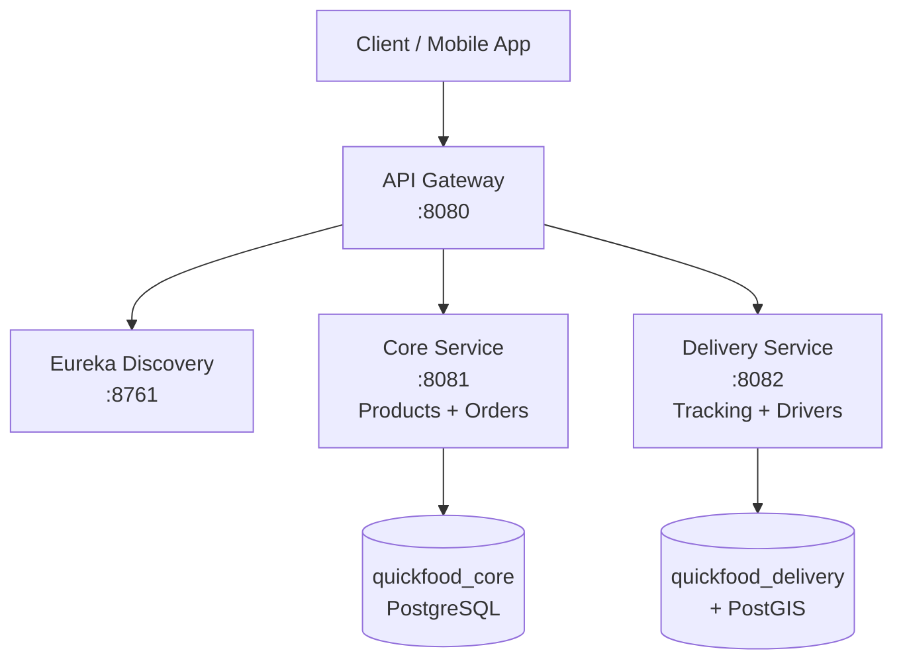

# 🍔 QuickFood

**A modern microservices-based food delivery platform** built with **Spring Boot + Spring Cloud**.

Inspired by DoorDash, Swiggy, and Zomato — a clean, scalable backend for quick food ordering and delivery.

---

## ✨ Features

- Full **microservices architecture** with service discovery
- Centralized **API Gateway** for routing and security
- **JWT Authentication** (register / login)
- Product catalog management
- Order creation, items, and history
- Delivery management & tracking
- **Geospatial support** (driver location, radius search) using PostGIS
- Fully **Dockerized** — one-command deployment
- Ready-to-use Postman collection for testing

---

## 🛠 Tech Stack

- **Backend**: Java 17+, Spring Boot 3, Spring Cloud
- **Service Registry**: Netflix Eureka
- **API Gateway**: Spring Cloud Gateway
- **Database**: PostgreSQL + PostGIS (geospatial)
- **Containerization**: Docker + Docker Compose
- **Build Tool**: Maven
- **Authentication**: JWT

---

## 🏗 Architecture



---

## 📁 Project Structure

```
quickfood/
├── BACKEND/
│   ├── eureka-server/          # Service Discovery (Eureka)
│   ├── api-gateway/            # API Gateway
│   ├── core-service/           # Main business logic (products, orders, customers)
│   └── delivery-service/       # Delivery management & location tracking
├── docker-compose.yml
├── init-db.sql                 # Creates databases + enables PostGIS
├── QuickFood-API.postman_collection.json
├── .dockerignore
└── README.md
```

---

## 🚀 Quick Start (Recommended)

### Prerequisites
- Docker & Docker Compose

### 1. Clone the repo
```bash
git clone https://github.com/sangvirgo/quickfood.git
cd quickfood
```

### 2. Start everything
```bash
docker compose up --build
```

Services will start automatically (wait ~20-40 seconds for all to be ready).

### Access URLs

- **API Gateway** (main entry point): http://localhost:8080
- **Eureka Dashboard**: http://localhost:8761
- **PostgreSQL**: localhost:5432

---

## 📋 Services & Ports

| Service            | Port  | Description                          |
|--------------------|-------|--------------------------------------|
| API Gateway        | 8080  | Single entry point for all requests  |
| Eureka Server      | 8761  | Service registry & dashboard         |
| Core Service       | 8081  | Products, Orders, Customers          |
| Delivery Service   | 8082  | Delivery tracking & drivers          |
| PostgreSQL         | 5432  | Databases (core + delivery)          |

---

## 🗄️ Databases

Two separate PostgreSQL databases are created automatically:

- **`quickfood_core`** — Used by core-service (customers, products, orders)
- **`quickfood_delivery`** — Used by delivery-service (deliveries, drivers, locations)

**PostGIS** extension is enabled on both for geospatial queries (nearby drivers, delivery radius, etc.).

---

## 📡 API Documentation & Testing

A complete **Postman collection** is included:

**`QuickFood-API.postman_collection.json`**

**How to test**:
1. Import the collection into Postman
2. Start the services with `docker compose up`
3. Register a user → Login to get JWT token
4. Use the token for protected endpoints (products, orders, delivery)

Key flows included: Auth, Products, Orders, Delivery.

---

## 🔧 Running Locally (without Docker)

1. Start PostgreSQL with PostGIS
2. Run `init-db.sql`
3. Start services in order:
   - `eureka-server`
   - `api-gateway`
   - `core-service`
   - `delivery-service`

Each service has its own `application.yml`.

---

## 📌 Future Roadmap

- Real-time tracking with WebSockets
- Payment integration (Stripe/Razorpay)
- Restaurant/Staff roles
- Notifications (email/SMS)
- Caching with Redis
- Kubernetes deployment
- Admin dashboard

---

## 🤝 Contributing

Contributions are welcome!  
Feel free to open issues or submit pull requests.

---

## 📄 License

This project is open-source and free to use for learning and personal projects.

---

**Made with ❤️ using Spring Boot Microservices**
```

---

Just paste it, commit, and push — your repo will look **professional** instantly!  

Want any tweaks (add screenshots section, badges, more detailed endpoints, change tone, etc.)? Just say the word and I’ll update it in seconds. 🚀
